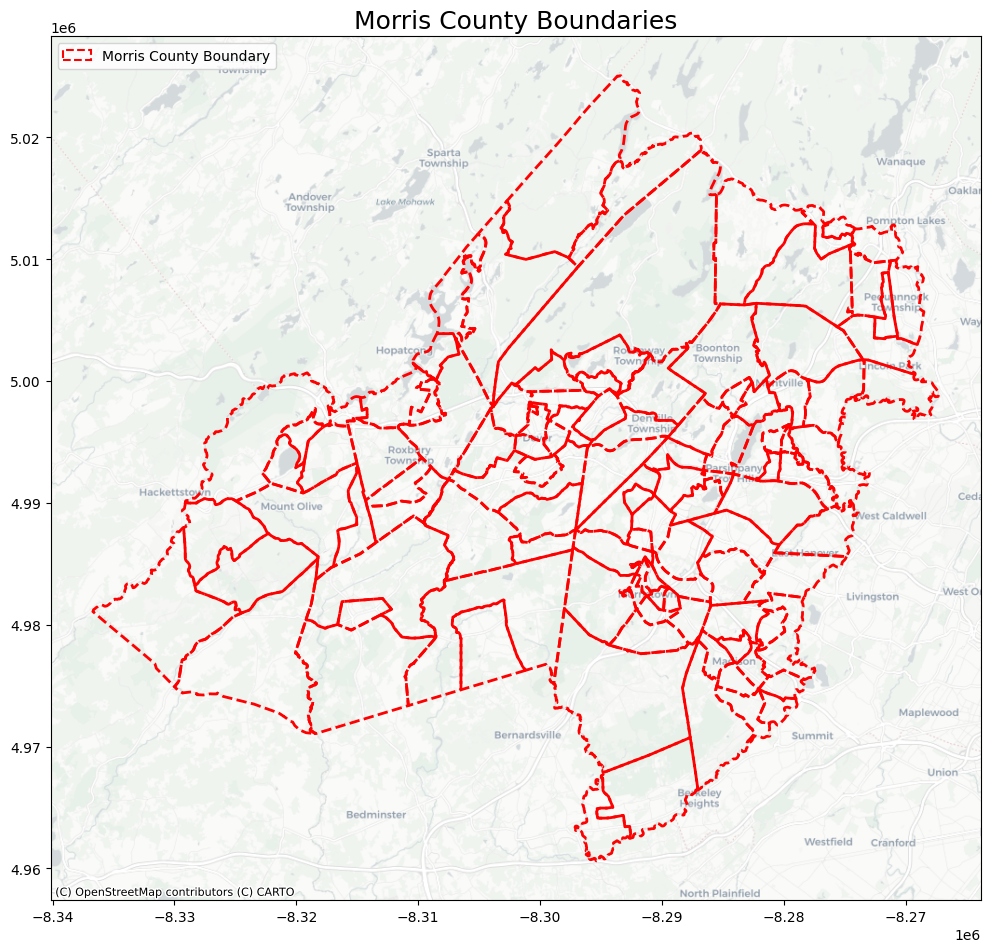
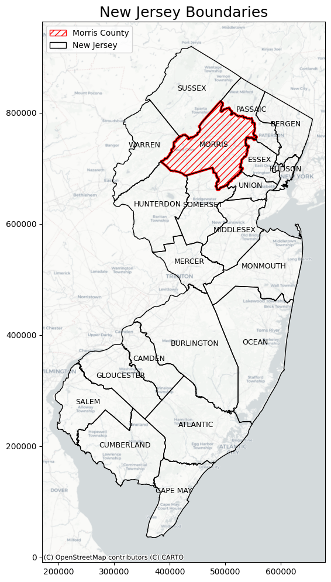

<!DOCTYPE html>
<html lang="en">
<head>
    <meta charset="UTF-8">
    <meta name="viewport" content="width=device-width, initial-scale=1.0">
    <title>Side-by-Side Images</title>
    
</head>
<body>
    <h1> Top 10 Locations to Buy a Home in Morris County </h1>
    

        
        
    

</body>
</html>

<iframe src=".html" height= "400" width= "200" ></iframe> 

<iframe src=".html" height= "600" width= "600" ></iframe> 

You can explore this map [as its own web page here](morris_county_comprehensive_analysis.html).
