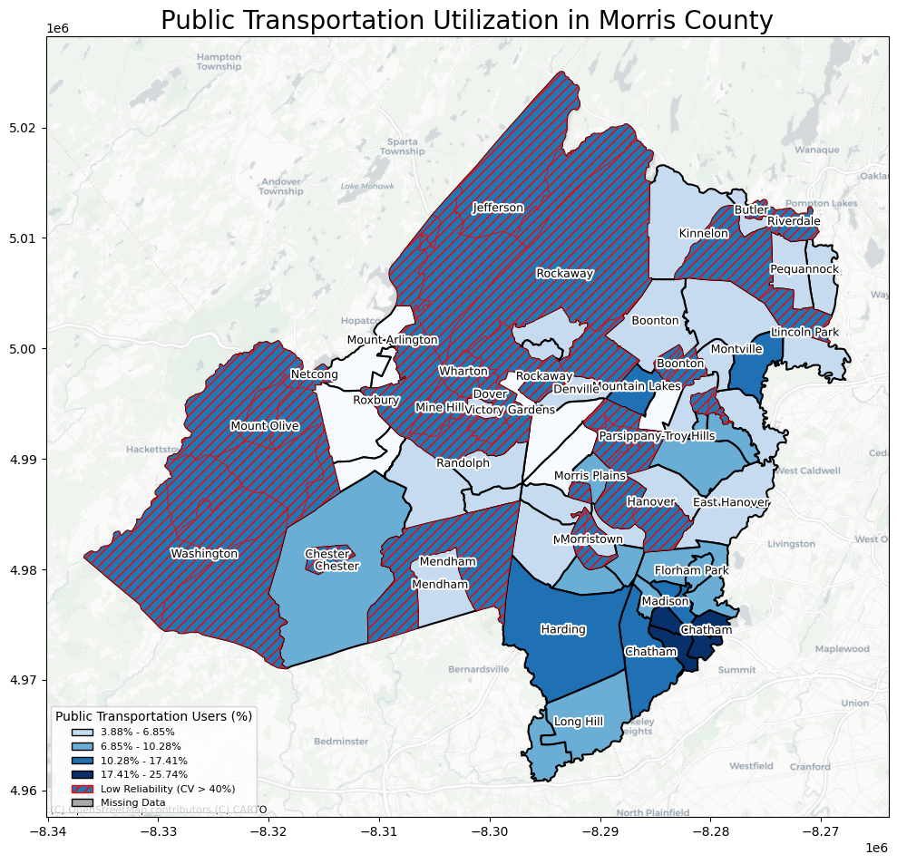
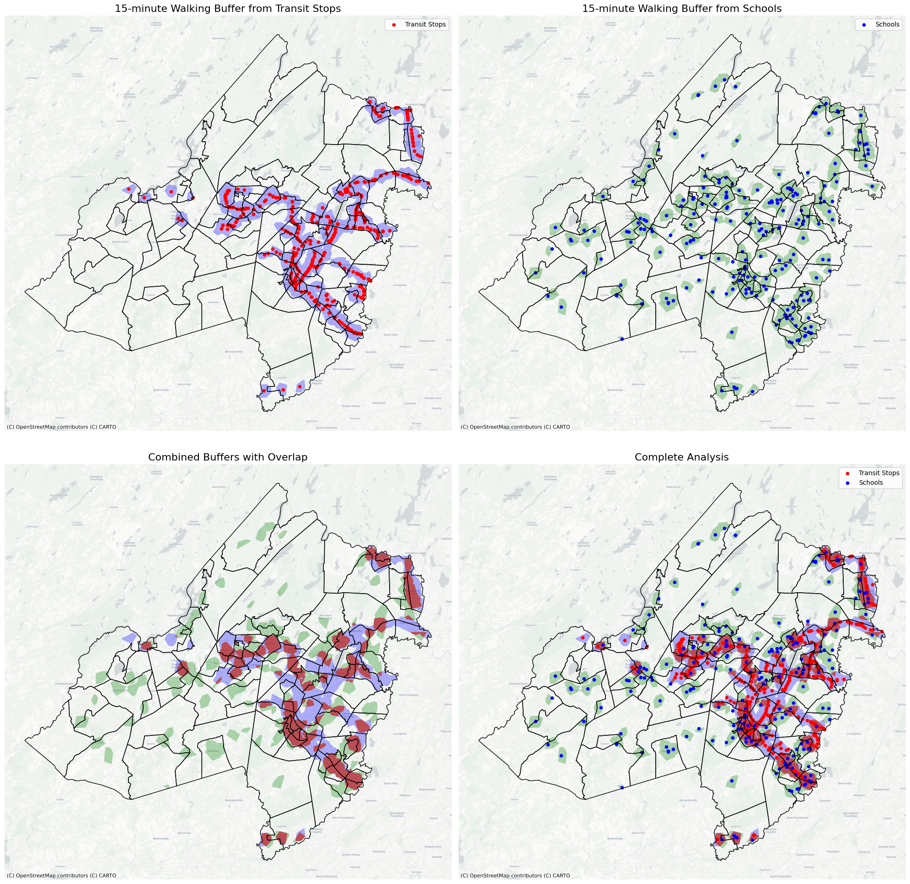
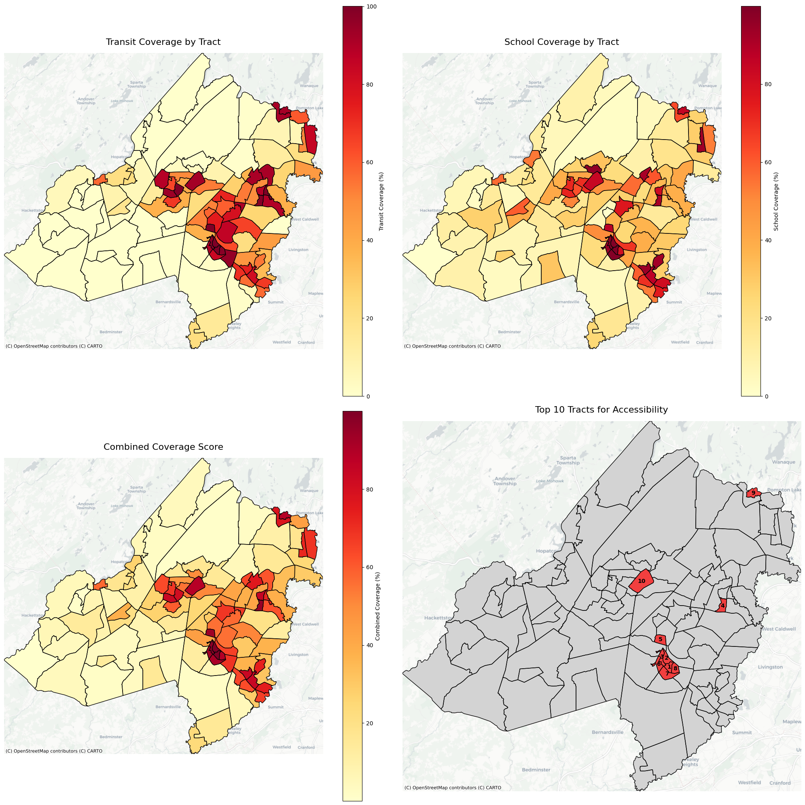

<!DOCTYPE html>
<html lang="en">
<head>
    <meta charset="UTF-8">
    <meta name="viewport" content="width=device-width, initial-scale=1.0">
    <title>Side-by-Side Images with Arrow</title>
    
</head>
<body>
    <h1>Morris County and New Jersey Boundaries</h1>
    

        

            
            
        

        
    

        
This map provides a detailed view of Morris County, including its municipalities and key boundaries.

    

          
        <!-- SVG Arrow -->
        <svg class="arrow-container">
            <defs>
                <marker id="arrowhead" markerWidth="10" markerHeight="7" 
                refX="9" refY="3.5" orient="auto">
                    <polygon points="0 0, 10 3.5, 0 7" fill="#ff0000"/>
                </marker>
            </defs>
            
            <!-- Curved arrow path pointing from NJ to Morris County -->
            <path class="arrow" 
                  d="M 380 200 C 300 200, 300 250, 380 250" />
        </svg>
    

    <h1>Public Transit Utilization in Morris County</h1>
    

        
    

    <h1>15 Minutes Walking Buffers from Schools and Transit Stops in Morris County</h1>
    
   
        
    
   

    <h1>Top 10 Locations for Accessibility in Morris County</h1>
    
     
        
    

    <h1>Morris County Interactive Map</h1>
    <!-- Map Section -->
    

        <iframe src="morris_county_comprehensive_analysis.html" title="Interactive Map"></iframe>
    

</body>
</html>
